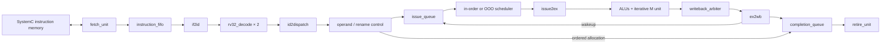

# Shared RV32IM arithmetic and branch RTL

This library implements four cores with the same external ports. The supported
ISA is the arithmetic and conditional-branch subset implemented by the SystemC reference:

- OP-IMM: ADDI, SLTI, SLTIU, XORI, ORI, ANDI, SLLI, SRLI, SRAI.
- OP: ADD, SUB, SLL, SLT, SLTU, XOR, SRL, SRA, OR, AND.
- M: MUL, MULH, MULHSU, MULHU, DIV, DIVU, REM, REMU.
- Conditional branches: BEQ, BNE, BLT, BGE, BLTU, BGEU.

Other encodings terminate with an illegal-instruction fault. In particular,
there are no loads/stores, jumps, LUI/AUIPC, compressed instructions,
CSRs, interrupts, or architectural trap handling. End-of-program is a memory
protocol response, not an ISA instruction. Reset is required to restart after
termination. Large `li` assembler pseudo-instructions may expand to unsupported
LUI instructions; construct constants with supported arithmetic when needed.

## Build and run

From the repository root, with CMake, a C++17 compiler, SystemC, and Verilator:

```sh
cmake -S . -B build -DCMAKE_BUILD_TYPE=Debug
cmake --build build --parallel 2
ctest --test-dir build --output-on-failure
```

The standalone library protocol test uses Verilator's `--binary --timing`
support and a compiler supporting C++ coroutines. Production RTL has no timed
processes. The repository Dockerfile supplies the development tools. For a
container build, run the same commands through `./run_docker.sh`, using a
separate build directory such as `build-docker`.

The original `./riscv_emulator/run.sh` remains usable without Verilator. The root
build can also disable RTL with `-DTINY5_BUILD_RTL=OFF`. New simulation models
link `instruction_memory`, the pipelined `rv32im_cpu`, the independent
`rv32im_reference_cpu`, and `rv32im_test_support` libraries; the memory
implementation is unchanged. The reference executes branches
independently and remains the retirement-trace oracle.

The implementation is synthesizable SystemVerilog intended for small portable
cores. Validation here covers elaboration, lint, protocol assertions, and
simulation. There is no technology-specific synthesis, timing, area, or FPGA
mapping signoff. Multiport register files and small queues use flip-flop arrays.

## Select and compose a core

| Top | Issue / retire width | Operand control | Scheduler | Register bank | Execution |
| --- | --- | --- | --- | --- | --- |
| `tiny5_single_inorder` | 1 / 1 | `inorder_operands` | `inorder_scheduler` | 32 architectural | 1 ALU + 1 M unit |
| `tiny5_dual_inorder` | 2 / 2 | `inorder_operands` | `inorder_scheduler` | 32 architectural | 2 ALUs + 1 M unit |
| `tiny5_dual_ooo` | 2 / 2 | `rename_control` | `ooo_scheduler` | 64 physical | 2 ALUs + 1 M unit |
| `tiny5_dual_ooo_retire` | 2 / 2 | `rename_control` | `ooo_scheduler` | 64 physical | 2 ALUs + 1 M unit |

Every top instantiates `core_pipeline`, which composes shared modules and
selects the controller through elaboration parameters. There is no runtime CPU
mode switch. `ISSUE_WIDTH` is 1 or 2; `OUT_OF_ORDER=1` requires width 2. All four
configurations have an eight-record fetch FIFO, an eight-entry issue
queue, and a 16-entry completion queue.



The completion queue is shared storage. It is a reorder buffer in the OOO
configuration and an ordered completion buffer in the in-order configurations.
In-order refers to instruction **issue**, not completion: an independent ALU
operation can finish while an older divide is still executing.

Each module is in its own same-named `.sv` file. The layout is:

```text
rtl/
  pkg/        packed payload types and fixed initial core capacities
  lib/        shared storage, pipeline, arithmetic, and composition modules
  control/    operand dependency, renaming, free-list, and scheduling logic
  tops/       four public CPU tops
  filelists/  common sources and one source list per top
  sim/        SystemC adapter, differential runner, verification-only wrappers
```

RTL is a source library. Compile `tiny5_pkg.sv` first, compile the remaining
modules once, and instantiate the desired top. Do not use `` `include `` to
paste module definitions into other modules. Each top's file list includes
`common.f` and its own top file. File-list paths are relative to the repository
root:

```sh
verilator --lint-only --assert -Wall -Wno-UNUSEDSIGNAL -Wno-UNUSEDPARAM \
  --top-module tiny5_single_inorder -f rtl/filelists/single_inorder.f
verilator --lint-only --assert -Wall -Wno-UNUSEDSIGNAL -Wno-UNUSEDPARAM \
  --top-module tiny5_dual_inorder -f rtl/filelists/dual_inorder.f
verilator --lint-only --assert -Wall -Wno-UNUSEDSIGNAL -Wno-UNUSEDPARAM \
  --top-module tiny5_dual_ooo -f rtl/filelists/dual_ooo.f
verilator --lint-only --assert -Wall -Wno-UNUSEDSIGNAL -Wno-UNUSEDPARAM \
  --top-module tiny5_dual_ooo_retire -f rtl/filelists/dual_ooo_retire.f
```

The two disabled warning categories cover unused fields/constants in common
payloads and inactive configurations. Structural, width, latch, and other lint
warnings remain fatal. The CMake build uses the same warning policy.

For a containing module that declares the same signal names, instantiation is
simply `tiny5_dual_ooo cpu (.*);`; replacing the module name selects another
core without changing connections. Explicit named connections are equally
valid. For example, a reusable arithmetic subsystem can import `tiny5_pkg::*`,
construct an `execute_t` request, and instantiate `muldiv_iterative` with the
same request/result handshake used by all four CPUs.

Capacities and tag widths in `tiny5_pkg` form one coherent library configuration;
changing a capacity requires changing its associated tag width and rerunning
the tests. They are not independent per-top tunables. Primitive parameters,
such as register-file word count and packet-queue depth, are local to their
instances. Keep the public top ports fixed when adding another configuration.

## External contract

| Port group | Width / behavior |
| --- | --- |
| `clk`, `reset` | Rising-edge clock; active-high synchronous reset |
| `imem_req_valid`, `imem_req_ready`, `imem_req_addr` | Ready/valid request with 32-bit byte address |
| `imem_rsp_valid`, `imem_rsp_ready`, `imem_rsp_data`, `imem_rsp_status` | Ready/valid response with 32-bit instruction and 2-bit status |
| `retire0_*`, `retire1_*` | Per lane: `valid` 1 bit, `pc` 32 bits, `rd` 5 bits, `value` 32 bits |
| `halted`, `fault`, `fault_code` | Sticky termination; 2-bit fault code |

Reset clears registers, rename state, queues, arithmetic work, protocol state,
and termination outputs; PC restarts at zero. The SystemC memory retains its
loaded program across reset. Hold reset through a rising edge before execution.

Fetch preserves the existing one-outstanding-request protocol. Requests remain
stable until accepted. Instruction words are 32 bits; PC advances by four on the predicted sequential path.
Response statuses are `OK=0`, `END_OF_PROGRAM=1`, `ACCESS_FAULT=2`, and
`RESERVED=3`. Reserved responses produce an instruction-access fault.

Retirement is an event sampled on a rising edge, with no ready/backpressure
input. Lane 0 is older; lane 1 is never valid alone. Single issue ties lane 1's
valid low. Every legal instruction emits one event, including writes to x0,
which report `rd=0,value=0`. Successful branches use the same zero-destination
event, with the branch instruction's PC. Invalid-lane payloads are not meaningful.

Fault codes match `cpu_protocol.h`: `NONE=0`, `ILLEGAL_INSTRUCTION=1`, and
`INSTRUCTION_ACCESS_FAULT=2`, and `INSTRUCTION_ADDRESS_MISALIGNED=3`. Halt and fault are mutually exclusive. A terminal
record waits behind all older instructions and never retires as an instruction.
A terminal record in the second slot cannot suppress the first slot's legal
retirement. The last retirement event is observable before termination rises.

Decode stops further fetching when it encounters a terminal record. Any request
already presented must complete its handshake; its response is drained and
discarded. After the terminal record is dispatched, younger frontend contents
are flushed. At terminal commit, execution and queue validity are cleared.
Termination waits for fetch drain and remains sticky until reset. A terminal
record behind an unresolved branch is provisional: an older taken-branch redirect
discards it and clears the frontend stop. Architectural termination occurs only
when the terminal record reaches the completion-queue head.

## Branch policies and shared composition

All cores predict not taken, with no prediction table, history, or additional
pipeline stage. The existing integer ALUs compare branch operands and calculate
the PC-relative target. Accepted writeback carries the outcome to the completion
queue. A taken target must be four-byte aligned; otherwise the branch becomes a
terminal misalignment fault and never retires. Untaken targets are not checked.
Branch offsets are signed 13-bit byte displacements, including the implicit zero
low bit. JAL and JALR remain unsupported.

`core_pipeline` composes the shared datapath and selects one branch controller
at elaboration through `BRANCH_AT_RETIRE`. The controllers have the same dispatch,
completion, retirement, redirect, flush, and restore interface. No runtime policy
switch or duplicate datapath is required.

| Controller | Cores | Younger dispatch | Taken-branch recovery |
| --- | --- | --- | --- |
| `branch_control_blocking` (option 2) | Both in-order cores and `tiny5_dual_ooo` | Stops at the first unresolved branch | Frontend flush and redirect on accepted branch writeback |
| `branch_control_retire` (option 4) | `tiny5_dual_ooo_retire` | Continues speculatively | Full younger-work flush and map restoration when the branch retires |

With option 2, sequential fetch continues until the frontend fills or sees a
terminal record. Dispatch stops exactly after the branch, including within a
two-instruction packet. Not-taken completion releases dispatch and preserves the
buffered path. Taken completion discards only frontend contents, allowing older
arithmetic to finish normally. No rename rollback is needed.

With option 4, completed branch outcomes remain in the completion queue until
ordered retirement. A taken branch retires alone in lane 0; a taken branch in
lane 1 waits for the next retirement cycle. Recovery cancels all remaining
queues, execution units, and writeback state. Concurrent younger dispatch and
writeback are suppressed. The speculative map is restored from the committed
map, the physical free bitmap is rebuilt as the complement of committed mappings
with p0 reserved, and committed values are marked ready. This is one synchronous
restore operation; it uses neither checkpoints nor a sequential ROB scan. Since
the branch retires alone and writes no register, the committed map has no same-edge
older update to reconcile.

Shared fetch accepts a redirect even with a blocked request or outstanding
response. It holds the old request address until accepted, discards the old
response (including terminal status), and starts the target request after drain.
Redirect overrides provisional stop state. Reset cancels both old transactions
and pending redirects. The one-outstanding-request protocol is unchanged.

Option 2 can redirect before an unrelated older divide retires. Option 4 can
execute independent younger instructions while a branch waits for its operands,
but taken branches wait for retirement. Neither policy guarantees fewer total
cycles for every program; the memory interface can limit both.

## Internal contracts and scheduling

`fetch_t`, `decode_t`, `execute_t`, `result_t`, and `rob_entry_t` are defined in
the package. `meta_t` carries PC, architectural destination, physical destination,
superseded physical destination, and completion tag. Functional units carry
metadata unchanged. `issue_t` adds the operation and two operands, each with a
ready bit, dependency tag, and captured value. Issue and execution packets also
carry the branch offset; result and completion packets carry the branch outcome
and target independently of the zero architectural result.

Scalar channels transfer on `valid && ready`. A producer with a blocked valid
transaction retains its payload. The arbitration outputs grant only ready
receivers, while each functional unit holds any unaccepted result. `issue2ex`
and `ex2wb` each wrap `elastic_reg`; they can consume and replace a record on
the same edge. Reset/flush cancels pending records.

Ordered queues expose `push_count`, `push_capacity`, `pop_count`, and
`pop_available`, all representing 0–2 records. Transfers are the consecutive
prefix of their two data ports. `if2id` and `id2dispatch` are two-record queues:
consuming only slot 0 preserves and compacts slot 1. A full queue exposes new
space on the cycle after a pop, avoiding combinational ready chains.

Operand values are captured at dispatch when available, or captured from
writeback on a matching wakeup. Wakeup also applies to newly dispatched entries
on the same edge, preventing a missed completion. Newly woken entries issue on
the following cycle. The architectural/physical register file provides four
combinational read ports and two ordered write ports.

### In-order variants

`inorder_operands` tracks at most one unretired writer per architectural
register. A WAW dependency stops dispatch; a RAW dependency becomes an unready
issue-queue operand. Completed, unretired values are available through the
completion queue's tag-indexed lookup. Register-file writes occur at retirement.

The scheduler takes the oldest consecutive ready instructions. If the oldest
instruction is waiting for a source or for the M unit, younger entries cannot
pass it. Both source values are captured before execution, so later register
writes cannot create WAR hazards. Dependencies within a two-instruction bundle
are tracked, and the dependent instruction waits for writeback.

For example, after `DIV x1,x2,x3`, `ADD x4,x5,x6` may issue while the divide is
busy. If the next instruction instead reads x1, it blocks all following issue.
The single-issue core still has independent ALU and M resources and can overlap
their execution while accepting only one instruction per cycle.

### Out-of-order variant

`rename_control` keeps speculative and committed maps, a 64-bit readiness table,
and a physical-register free list. Reset maps x0–x31 to p0–p31 and makes
p32–p63 free. p0 is permanently zero and ready. Instructions targeting x0
allocate no physical register but still execute and retire.

Dispatch is ordered and up to two wide. The second instruction sees the first
instruction's mapping changes. Thus a pair writing the same architectural
register receives distinct physical destinations, and an intra-pair RAW source
uses the first destination's physical tag.

The scheduler selects the oldest ready operations compatible with the available
issue staging and M resource. Age is the circular distance from the completion
queue head, so tag wrap does not invert priority. Completion updates the
physical register file and the completion queue. Retirement updates the
committed map and releases the superseded physical register in lane order.
Free registers released on an edge become allocatable on the following cycle.

### Arithmetic timing

ALUs have one-cycle request-to-result latency and registered, stallable results.
The M unit accepts one operation at a time: 32 iterative multiply or restoring
divide steps, then one result-correction step. Its valid result appears 33
cycles after request acceptance. There are no early exits, even for zero or
overflow cases. Backpressure extends the result's holding time, not computation.

Signedness is handled by magnitude preprocessing and result sign correction.
High multiplication selects the correct 64-bit product half. DIV rounds toward
zero, REM follows the dividend's sign, division by zero returns the ISA-defined
quotient/remainder, and `INT_MIN / -1` returns `INT_MIN` with zero remainder.

Two ALUs and the M unit may finish together. The round-robin writeback arbiter
accepts up to two results and leaves the remaining unit's result buffered.
Completion tags remain allocated until ordered retirement. Reset, terminal
flush, and retirement-time branch recovery cancel outstanding units before
discarded tags can be reused.

## Verification and performance interpretation

`core_test_wrapper` instantiates the actual public tops and exposes scheduling
signals only for verification. The production tops have no debug ports.
`RtlCpuAdapter` converts Verilator's generated numeric port types to the existing
SystemC `sc_uint` protocol. Each differential test runs the RTL core, matching
pipelined SystemC CPU, and independent reference interpreter against separate
instances of the unchanged memory model. It compares RTL/SystemC fetch
handshakes, valid payloads, both retirement lanes, and termination every cycle.
It also compares the complete ordered `(pc, rd, value)` traces and terminal
status against the interpreter.

`RetirementState` contains the architectural reconstruction logic. Both the
original scalar scoreboard and `DualRetirementScoreboard` use it; the dual
monitor applies lane 0 before lane 1. The original scalar interface is preserved.

The core regressions cover the original catalog, normal/stalled memory, seeded
random programs, repeated name dependencies, x0, strict illegal encodings,
faults after valid prefixes, end-of-program behind long operations, a full
4 KiB image, queue/tag reuse, reserved response status, and in-flight reset.
Coverage checks require dual dispatch/issue/retirement in the dual cores and
actual issue-order inversion only in the OOO cores. The monitor assigns dynamic
ages at dispatch using ROB tags, so backward loops are not mistaken for OOO issue.
Branch cases cover all comparisons, loops, precise alignment faults, provisional
terminal responses, repeated recovery, wrong-path writers and branch faults,
reset, and the different dispatch/redirect timing of the two policies. Focused
branch protocol tests cover held fetch requests, concurrent redirect/response,
committed-map restoration, physical-register reclamation, and retirement lanes.

The standalone library tests exercise partial queue transfers, held payloads,
flush, full queues, free-list exhaustion, simultaneous release/allocation,
writeback arbitration, circular age ordering, intra-bundle renaming, ROB reuse,
649 M-operation checks with exact latency and result stalls, arithmetic
cancellation, and precise terminal handling with a completed younger entry.
Assertions additionally check queue bounds, tag ownership, duplicate completion,
register-map uniqueness, retirement ordering, and post-termination inactivity.

The memory is intentionally unchanged: one request outstanding and one 32-bit
word per transaction, including the model's handshake turnaround. The initial
frontend adds buffering/registered control latency and does not sustain one
fetch per cycle. Two-wide issue is visible in bursts after buffering or stalls;
these tests do not claim sustained two-instruction-per-cycle execution. A future
wide or cached frontend can replace fetch delivery while retaining the decoded
packet, execution, completion, and retirement contracts.
